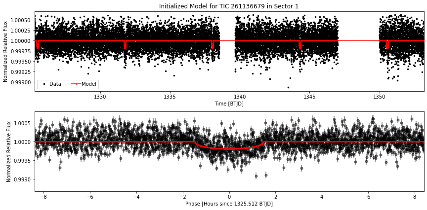

In this repository is a tutorial on how to use LightKurve Version 2 to recover the transit detection of Pi Mensae c and use the exoplanet Python package to constrain the transit parameters from a TESS light curve.

Below are example of the output files using the functions available in the Python script "Pymc3_4_parameter_MCMC_TransitFit.py"

